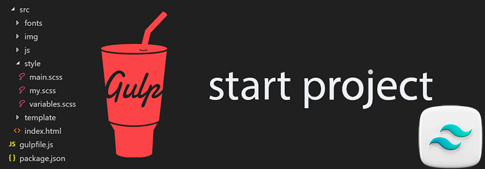

<h1>Gulp-start-tailwindcss-4 build</h1>
											  
ПРО ЗБІРКУ
--------------------------------------------------
- Автор: Андрій Овчаров;
- Дата збірки: 08.07.2025;
- Gulp-start-tailwindcss — це стартова збірка для веброзробників, створена спеціально для комфортної роботи з Tailwind CSS v.4. Вона значно полегшує та пришвидшує верстку сайтів за макетами Figma завдяки вбудованим плагінам, автоматизації рутинних задач і модульній структурі проєкту.

**Збірка підтримує:** 
- Tailwindcss: v.4.1
- Gulp CLI: v.3.0.0
- npm: v.11.1.0
- Node JS: v.22.14.0 (LTS)

ЗБІРКА ДОЗВОЛЯЄ:
-------------------------------------------------
- Оптимізувати .css з підтримкою автопрефіксів;
- Мініфікувати (стискати) файли .css, .js та файли зображень;
- Виконувати розробку вебсайту в live-режимі з автоматичним оновленням сторінок та без кешування завдяки BrowserSync;
- Конвертувати файли зображень .png та .jpg у формат .webp та .avif;
- Оптимізувати зображення .svg та виконувати очищення кешу зображень;
- Конвертувати шрифти з .ttf та .otf у .woff та .woff2;
- Перевіряти .css файли на помилки та відповідність стандартам за допомогою CSS Lint;
- Підтримує модульну будову, розробку вебсайту з окремих компонентів;
- Показувати повідомлення про помилки під час компіляції стилів та скриптів.

ПІДГОТОВКА ТА РОБОТА ЗІ ЗБІРКОЮ:
----------------------------------------------------
1. Встановити/оновити до останньої версії Node.js: (^22.14.0)
2. Встановити npm пакетний менеджер
3. Команди для встановлення gulp (у разі потреби):  
```npm install --global gulp-cli```</br>
```npm install --save-dev gulp```
4. Розгорнути стартову збірку: ```npm i``` (або ```npm install```)
5. Запустити gulp: ```gulp``` (або ```npm run dev```)
6. Завершити роботу gulp: Ctrl+C
7. Зібрати фінальний проєкт в папку /dist: ```gulp build``` (або ```npm run build```)

ПЕРЕВІРКА РОБОЧОГО СТАНУ ЗБІРКИ:
----------------------------------------------------
Після розпаковки вмісту архіву у теку з проєктом необхідно розгорнути Збірку (команда: ```npm i```) та запустити Gulp (команда: ```gulp```).
Якщо у вікні браузера відобразиться текст привітання, то збірка працює коректно.

СТРУКТУРА ЗБІРКИ:
----------------------------------------------------
```
app/
|-- components/
|   |-- header.html
|   |-- footer.html
|
|--css/
|   |-- input.css
|
|-- fonts/
|   |-- src/
|   
|-- images/
|   |-- icons/
|   |-- src/
|
|-- js/ 
|   |-- main.js 
|   
|-- pages/
    |-- index.html
   
.gitignore 
gulpfile.js 
package.json
postcss.config.js
LICENCE
README.md
```

РОБОТА З ФАЙЛАМИ ПРОЄКТА
---------------------------------------------------

Робота із зображеннями:
Всі вихідні зображення потрібно зберігати у теці app/img/src. Зображення будуть конвертовані у формат .webp та avif.
Зображення іконок svg не конвертуються, а лише стискаються. Такі зображення необхідно зберігати в окремій теці: app/img/icons. 
Після обробки, зображення іконок буде автоматично додано до теки: app/img/icons.


Робота зі шрифтами:
---------------------------------------------------
Всі вихідні шрифти у форматі .ttf та .otf необхідно зберігати у теці: app/fonts/src. Всі вони будуть конвертовані у формати: .woff та .woff2 та переміщені до теки: app/fonts. 
Для успішної конвертації шрифтів, бажано зупинити Gulp, додати шрифти до папки та повторно запустити Gulp. Конвертація шрифтів може зайняти деякий час.


Робота зі стилями css:
---------------------------------------------------
Кастомні стилі необхідно прописувати у файлі input.css за адресою app/css.


Робота зі скриптами javascript:
----------------------------------------------------
Усі вихідні скрипти бажано прописувати у відповідні файли за адресою app/js/main.js. Скрипти плагінів, встановлені через npm, необхідно прописувати gulpfile.js.


Робота зі сторінками html:
----------------------------------------------------
Всі сторінки html слід зберігати за адресою: app/pages, а окремі їх компоненти (header.html, sidebar.html, footer.html та ін.) рекомендується зберігати за адресою: app/components і під'єднувати до html-сторінок, через @@include.

Наприклад: 

@@include('header.html') - під'єднуємо header.html

... код сторінки ...

@@include('footer.html') - під'єднуємо footer.html

РЕКОМЕНДОВАНІ ПЛАГІНИ ДЛЯ VS CODE:
-------------------------------------------------
- [Tailwind CSS IntelliSense](https://marketplace.visualstudio.com/items?itemName=bradlc.vscode-tailwindcss)
- [Tailwind Snippets](https://marketplace.visualstudio.com/items?itemName=Zarifprogrammer.tailwind-snippets)


## ☕ Сподобалась збірка? 
Пригостіть автора кавою через [PayPal](https://www.paypal.com/donate/?business=datoshcode@gmail.com)


Приємної роботи!




 ## Ліцензія

<a href="LICENSE">MIT LICENSE</a>
